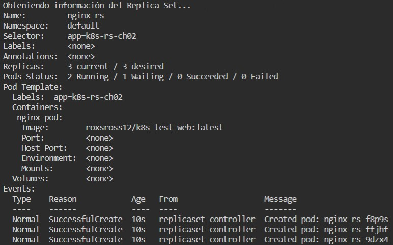
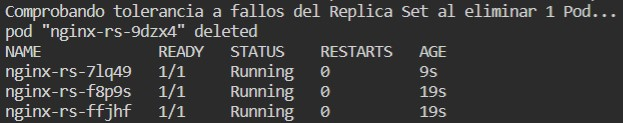
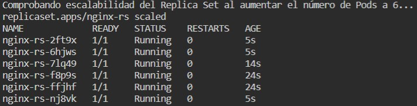

# KUBERNETES

## CHALLENGE \#02: "ReplicaSet"

### Archivos
En la carpeta *'Solution'* se encuentran los archivos [`05_ch02.sh`](../Solution/05_ch02.sh) y [`nginx-rs.yaml`](../Solution/nginx-rs.yaml), el primero contiene los comandos requeridos para completar el Challenge #02 que consiste en crear un Replicat Set y comprobar su tolerancia a fallos así como su capacidad de escalabilidad, mientras que el segundo contiene la definción en formato YAML para dicho Replica Set.

### Resultados
**1.** La siguiente imagen muestra una captura de pantalla al correr los comandos para comprobar que el Replica Set fue creado correctamente.<br />
```bash
kubectl apply -f nginx-rs.yaml
kubectl get rs,pod
```


**2.** La imagen que se muestra a continuación es una captura de pantalla del resultado del siguiente comando para obtener información detallada del Replica Set.<br />
```bash
kubectl describe rs nginx-rs
```



**3.** La siguiente imagen muestra una captura de pantalla del resultado de correr los siguientes comandos para verificar la tolerancia a fallos por parte del Replica Set, esto al eliminar uno de los Pods.<br />
```bash
POD=$(kubectl get pods --no-headers -o custom-columns=":metadata.name" | head -n 1)
kubectl delete pod $POD
kubectl get pods
```



**4.** Finalmente, la siguiente imagen muestra una captura de pantalla del resultado de correr los siguientes comandos para verificar la escalabilidad que ofrece el Replica Set, esto al aumentar el número de Pods a 6.<br />
```bash
kubectl scale rs nginx-rs --replicas=6
kubectl get pods
```

