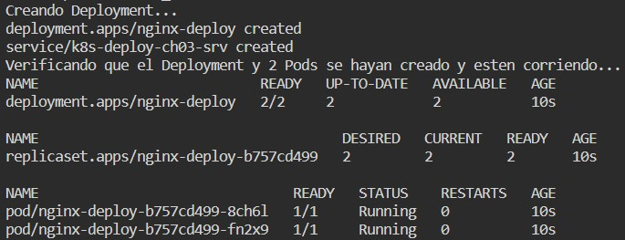
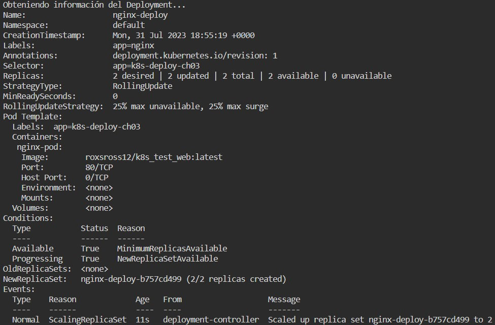
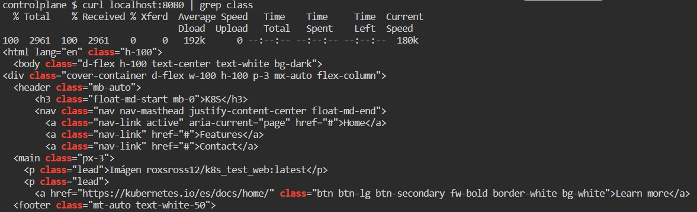
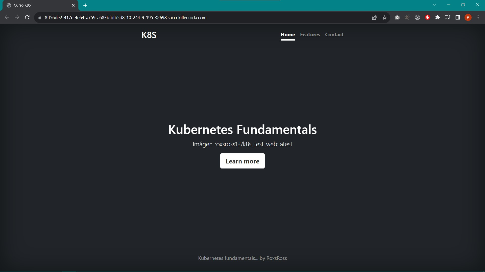
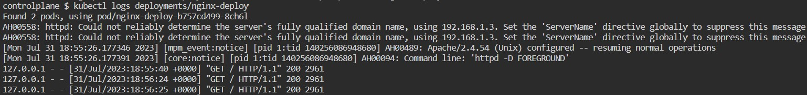

# KUBERNETES

## CHALLENGE \#03: "Trabajando con Deployments"

### Archivos
En la carpeta *'Solution'* se encuentran los archivos [`05_ch03.sh`](../Solution/05_ch03.sh) y [`nginx-deploy.yaml`](../Solution/nginx-deploy.yaml), el primero contiene los comandos requeridos para completar el Challenge #03 que consiste en crear un Deployment que permita desplegar una imagen de un servidor web con una página estática, mientras que el segundo contiene la definción en formato YAML para dicho Deployment, con un agregado extra que facilita el acceso a la página estática en un navegador, esto por medio de un service de tipo NodePort.

### Resultados
**1.** La siguiente imagen muestra una captura de pantalla al correr los comandos para comprobar que el Deployment fue creado correctamente.
```
kubectl apply -f nginx-deploy.yaml
kubectl get deploy,rs,pod
```



**2.** La imagen que se muestra a continuación es una captura de pantalla del resultado del siguiente comando para obtener información detallada del Deployment.
```
kubectl describe deploy nginx-deploy
```



**3.** Las siguientes imágenes muestran diferentes formas de comprobar que el servidor esta corriendo correctamente, la primera a través de la consola por medio del comando:
```
curl localhost:8080
```
mientras que la segunda es por medio de un navegador, gracias a la creación de un service de tipo NodePort.



**4.** Finalmente, la próxima imagen muestra una captura de pantalla del resultado del comando que permite obtener los logs de acceso del Deployment.
```
kubectl logs deployment/nginx-deploy
```

