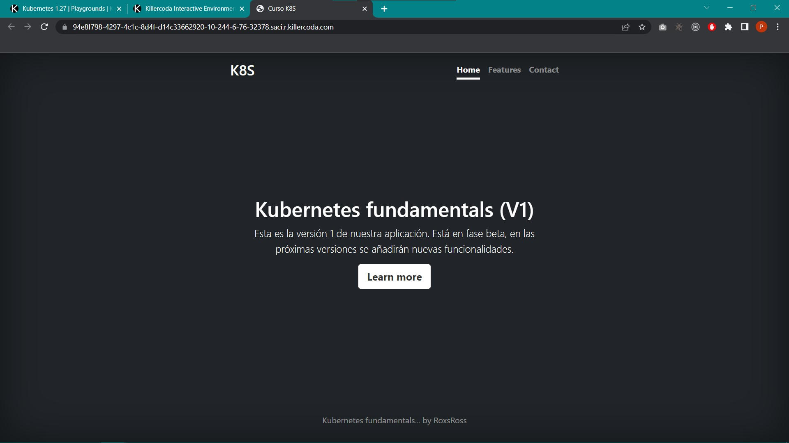
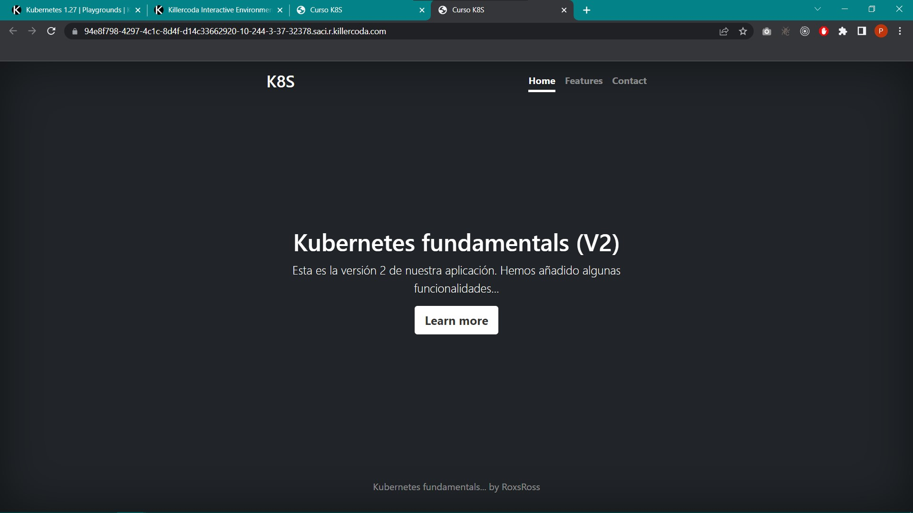
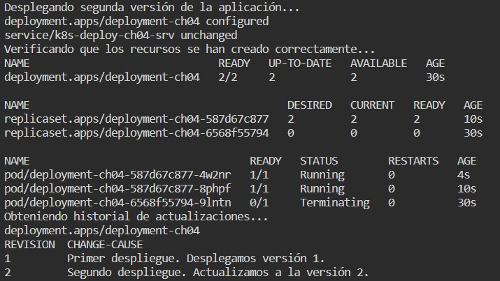
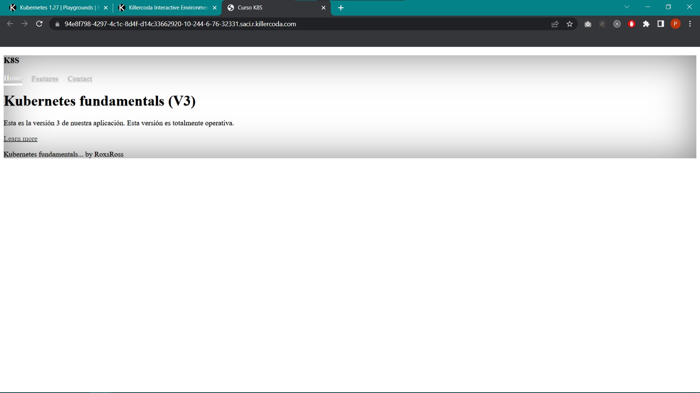
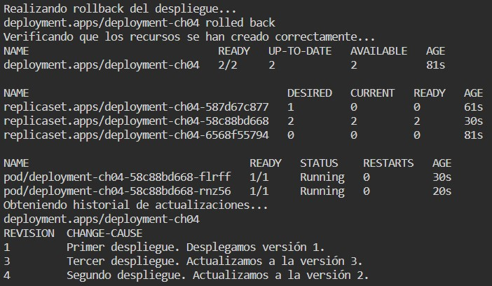
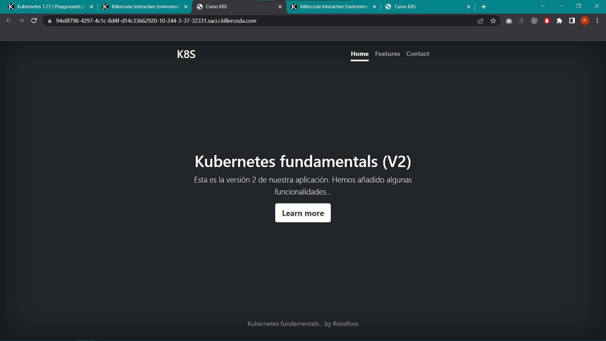

# KUBERNETES

## CHALLENGE \#04: "Actualización y desactualización de nuestra aplicación"

### Archivos
En la carpeta *'Solution'* se encuentran los archivos [`05_ch04.sh`](../Solution/05_ch04.sh) y [`web-deploy.yaml`](../Solution/web-deploy.yaml), el primero contiene los comandos requeridos para completar el Challenge #04 que consiste en desplegar diferentes versiones de una aplicación a través de un mismo Deployment y realizar un rollback debido a un fallo en la aplicación, mientras que el segundo contiene la definción en formato YAML para dicho Deployment.

### Resultados
**1.** La siguiente imagen muestra el acceso a la primera versión de la aplicación desde un navegador.



**2.** La siguiente imagen muestra el acceso a la segunda versión de la aplicación desde un navegador.

Y a continuación se muestra el historial de actualización del despliegue después de actualizar a la segunda versión, esto a través de los siguientes comandos:
```
kubectl apply -f web-deploy-ch04.yaml
kubectl get deploy,rs,pod
kubectl rollout history deployment/deployment-ch04
```



**3.** La siguiente imagen muestra el acceso a la tercera versión de la aplicación desde un navegador.


**4.** Finalmente, la próxima imagen muestra una captura de pantalla del historial de actualización del despliegue después de realizar un rollback, esto por medio de los siguientes comandos.
```
kubectl rollout undo deployment/deployment-ch04
kubectl get deploy,rs,pod
kubectl rollout history deployment/deployment-ch04
```

Y por último, siguiente la imagen muestra el acceso a la aplicación desde un navegador después del rollback.

