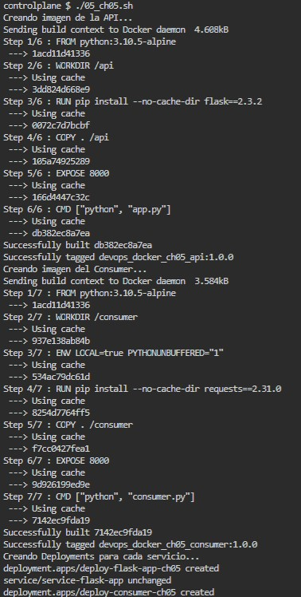
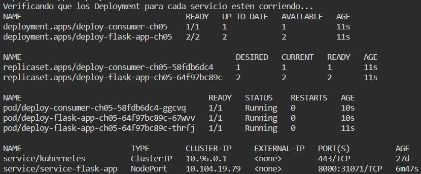
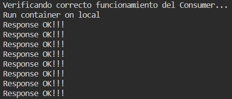
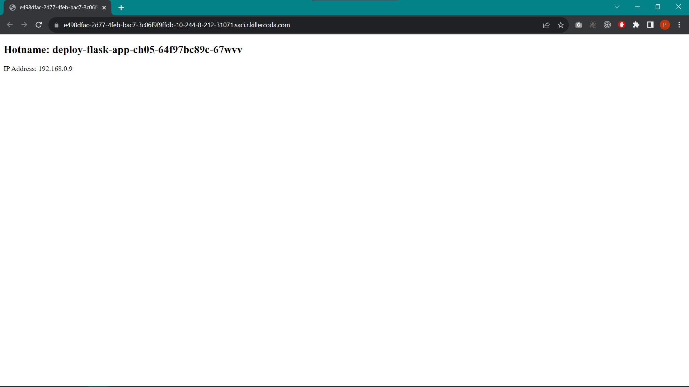

# KUBERNETES

## CHALLENGE \#05: "Despliegue de la aplicación Flask-k8s"

### Archivos
En la carpeta *'Solution'* se encuentra el archivo [`05_ch05.sh`](../Solution/05_ch05.sh), y en la subcarpeta *'manifest'* los archivos [`flask-app.yaml`](../Solution/manifest/flask-app.yaml) y [`consumer.yaml`](../Solution/manifest/consumer.yaml), el primero contiene los comandos requeridos para completar el Challenge #05 que consiste en desplegar una API basica de flask con un consumidor que accede desde el service de la API, mientras que los dos ultimos contiene la definción en formato YAML para el Deployment de la API y del Consumer, respectivamente.

### Resultados
**1.** Las siguientes imágenes muestran una captura de pantalla al momento de correr los comandos para crear las images de Docker de la API y del Consumer, asi como la creación y verificación de los Deployments para cada servicio.
```
docker build -t devops_docker_ch05_api:1.0.0 src/app/
docker build -t devops_docker_ch05_consumer:1.0.0 src/consumer/
kubectl apply \
  -f ./manifest/flask-app.yaml \
  -f ./manifest/consumer.yaml
kubectl get deploy,rs,pod,service
```




**2.** La siguiente imagen muestra el acceso a los logs del consumer para verificar su correcto funcionamiento.
```
kubectl logs deployments.apps/deploy-consumer-ch05
```


**4.** Finalmente, la próximas imágenes muestran una captura de pantalla del acceso a la aplicación desde un navegador para cada uno de los pods que fueron creados por medio del Deployment.


