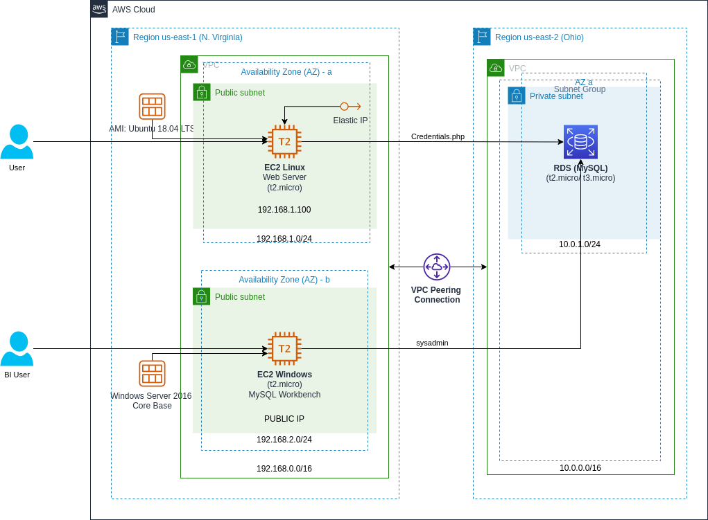
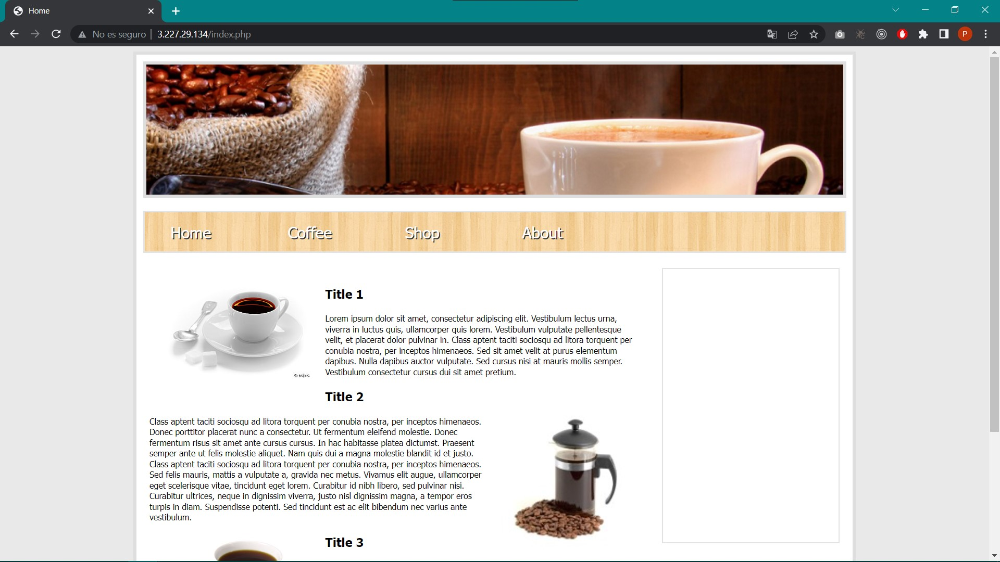
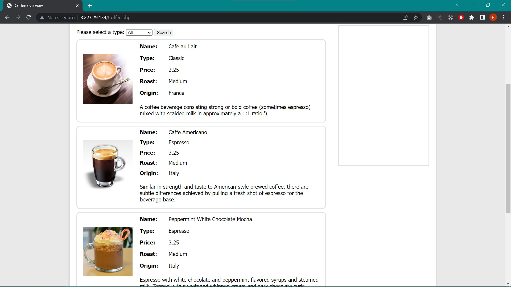
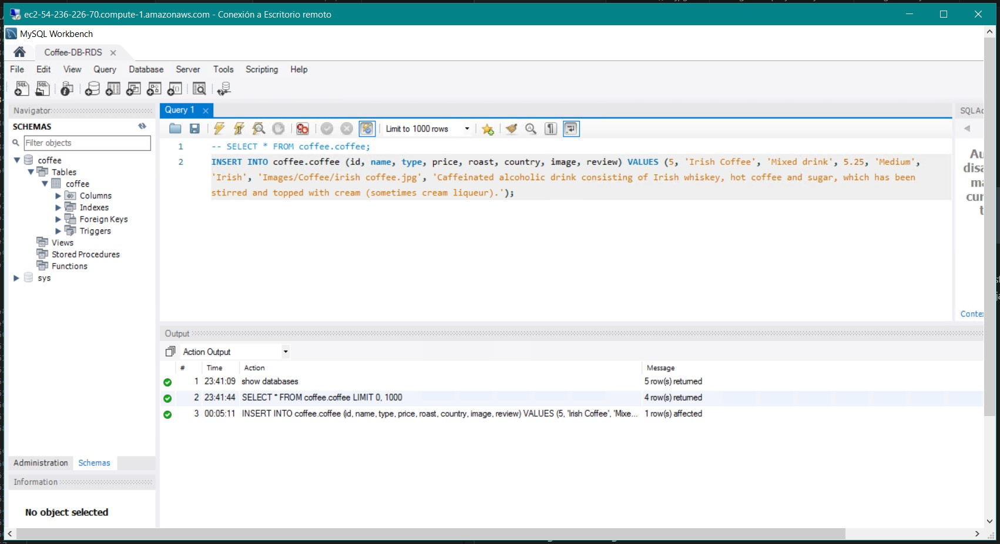
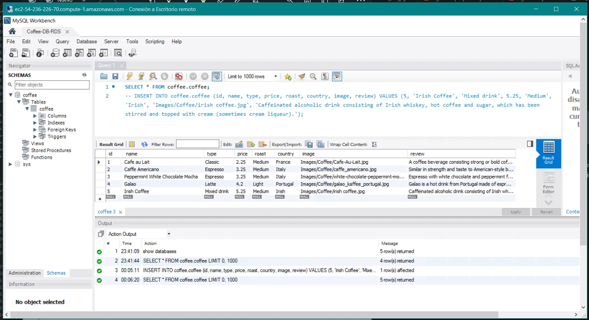
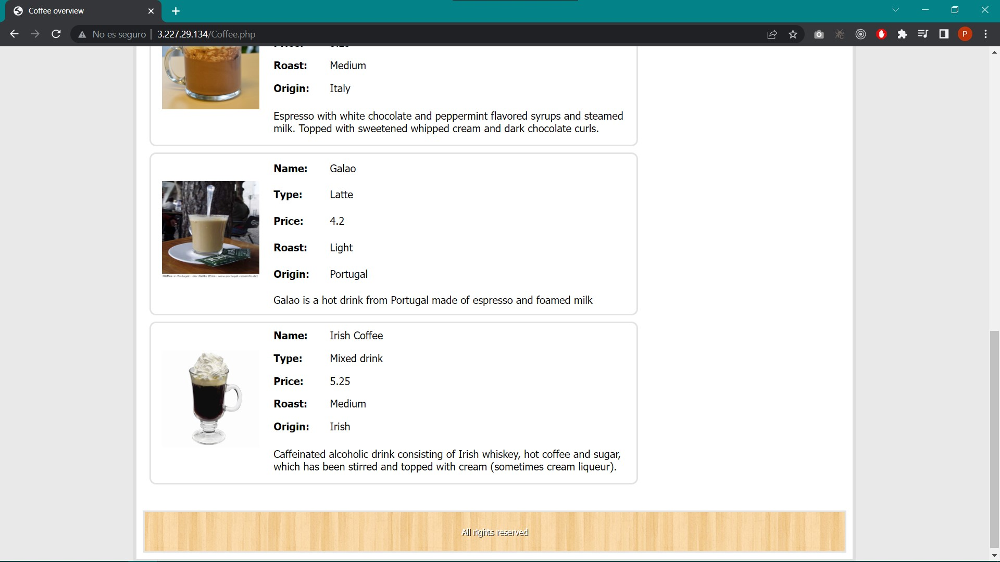

# AWS

## CHALLENGE \#01

### Archivos
En la carpeta *'Solution'* se encuentran los archivos [`06_ch01-local.sh`](../Solution/06_ch01-local.sh) y [`06_ch01-deploy.sh`](../Solution/06_ch01-deploy.sh), los cuales contienen el script desarrollado para instalar las herramientas necesarias que permitan correr la aplicación, tanto a nivel de frontend como de backend (los archivos de la aplicación se encuentran en la carpeta ['Coffee-App/'](../../Coffee-App/)) para la arquitectura que se muestra a continuación (la arquitectura fue creada desde cero por medio de la consola de AWS), la diferencia entre ambos archivos es que el primero es para desplegar la aplicación en un ambiente local con Linux, mientras que el segundo es para un ambiente en producción con Linux, en este caso en una instancia de EC2 de AWS.
  

### Resultados
**1.** Las siguientes imágenes muestran el acceso a la aplicación desde un navegador, mostrando la página *index.php* y *Coffee.php*, respectivamente. 

**2.** Las siguiente imágenes muestran capturas de pantalla desde la instancia “EC2 Windows” con MySQL Workbench, al momento de actualizar la base de datos para incluir un nuevo tipo de café en este caso *'Irish Coffee'*. 

**3.** Finalmente, la próxima imagen muestra el acceso a la aplicación desde un navegador con los cambios a la base de datos reflejados, esto en la página *Coffee.php*. 

