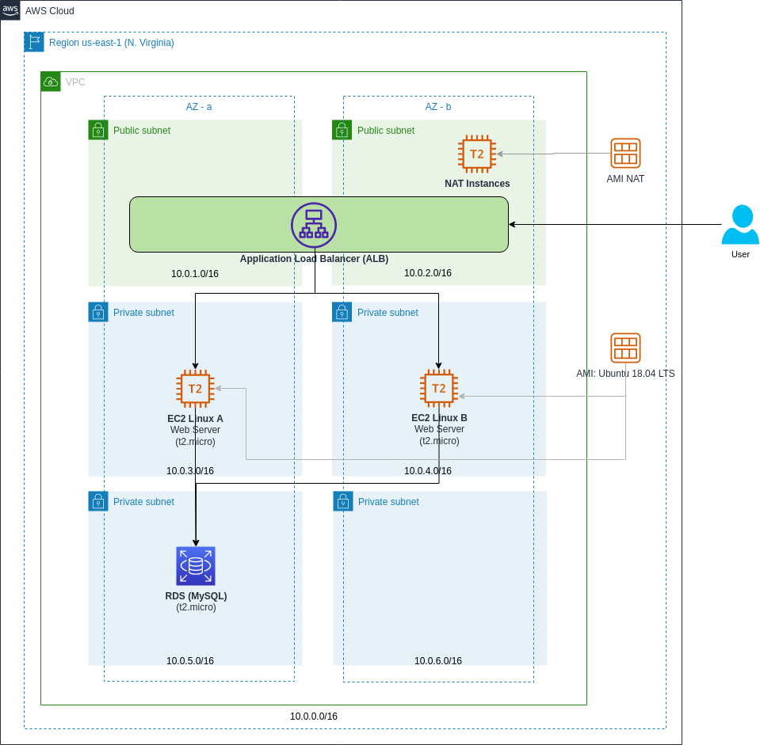
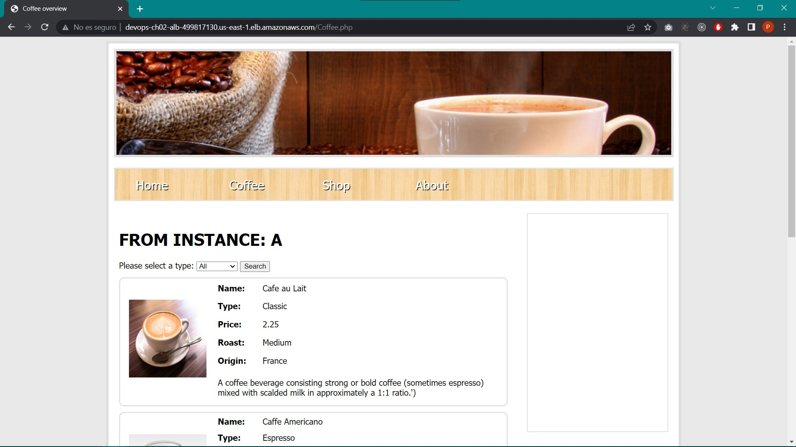
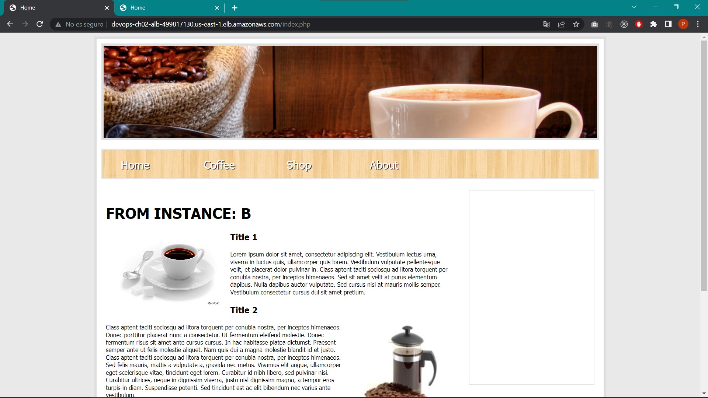
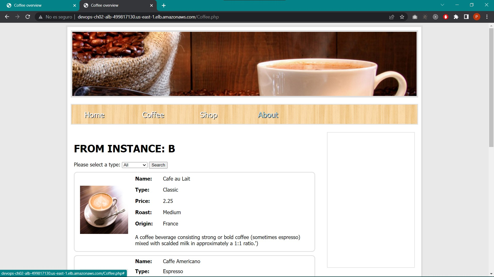
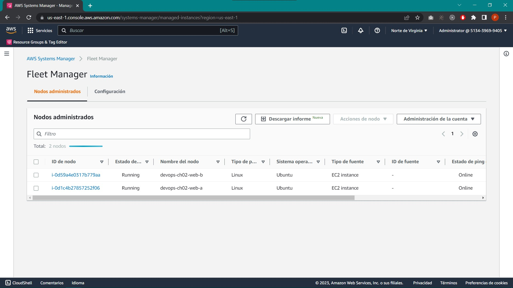
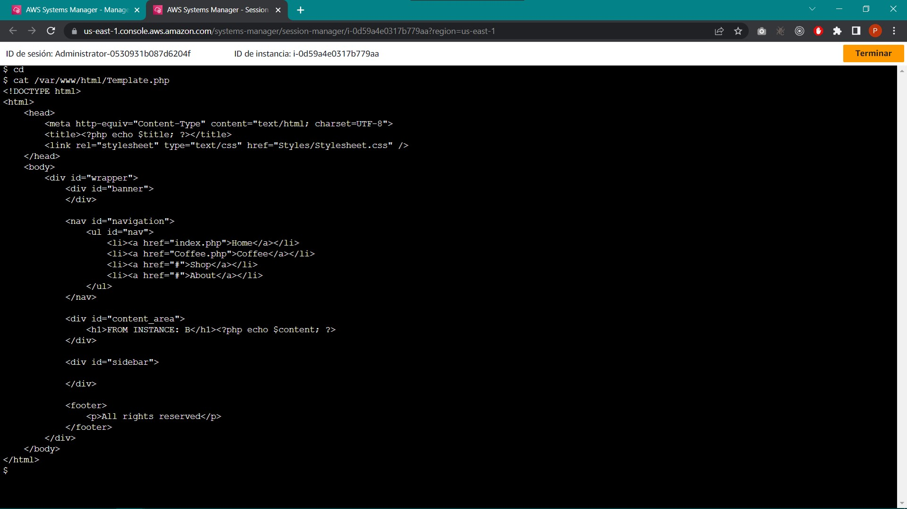

# AWS

## CHALLENGE \#02

### Archivos
En la carpeta *'Solution'* se encuentran los archivos [`06_ch02-local.sh`](../Solution/06_ch02-local.sh), [`06_ch02-deploy-A.sh`](../Solution/06_ch02-deploy-A.sh) y [`06_ch02-deploy-B.sh`](../Solution/06_ch02-deploy-B.sh), los cuales contienen el script desarrollado para instalar las herramientas necesarias que permitan correr la aplicación (los archivos de la aplicación se encuentran en la carpeta ['web-app/'](../../Apps/web-app/)) para la arquitectura que se muestra a continuación (la arquitectura fue creada desde cero por medio de la consola de AWS), la diferencia entre los archivos es que el primero es para desplegar la aplicación en un ambiente local con Linux, mientras que los otros dos son para desplegar cada uno una versión diferente de la aplicación para un ambiente en producción con Linux, en este caso en una instancia de EC2 de AWS.
  

### Resultados
**1.** Las siguientes imágenes muestran el acceso a la aplicación desde un navegador, mostrando la página *index.php* y *Coffee.php* para las dos versiones de la aplicación desplegadas. 

**2.** La siguiente imagen muestra captura de pantalla de la consola de AWS mostrando las dos instancias de EC2 que fueron desplegadas y que pueden ser accedidas desde el servicio "System Manager - Session Manager". 

**3.** Finalmente, las próximas imágenes muestran el acceso a cada una de las instancias de EC2 por medio del servicio "System Manager - Session Manager", mostrando el contenido estático que cada una tiene para comprobar que existen dos versiones diferentes de la aplicación. 

