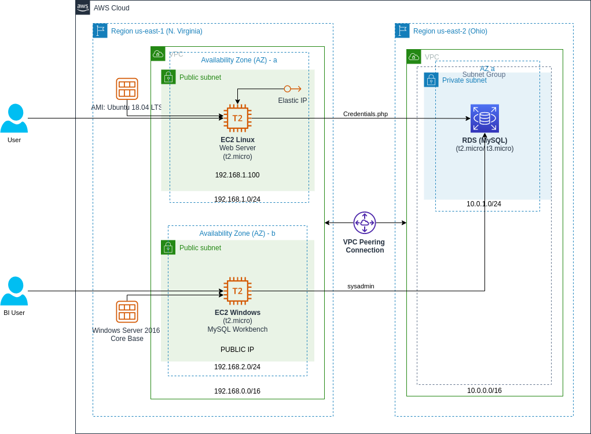

# TERRAFORM

## AWS - CHALLENGE \#01

### Archivos
En la carpeta [`Solution/`](../Solution/) se encuentra el archivo [`07_aws-ch01-deploy.sh`](../Solution/07_aws-ch01-deploy.sh) que contiene el script desarrollado para instalar las herramientas necesarias que permitan correr la aplicación (los archivos de la aplicación se encuentran en la carpeta ['web-app/'](../../../../../6%20-%20AWS/Challenge/Apps/web-app/)) en una instancia de EC2 con Linux, mientras que la carpeta [`Terraform/`](../Solution/Terraform/) contiene los archivos necesarios que permiten definir la arquitectura que se muestra a continuación.
  

### Resultados
**1.** La siguiente imagen muestra los outputs definidos que retornan información sobre la infraestrutura desplegada, como el endpoint de la base de datos, el DNS de la instancia con Windows Server, la contraseña para conectarse a dicha instancia y el DNS del servidor con la aplicación web. 

**2.** Las siguientes imágenes muestran el acceso a la aplicación desde un navegador, mostrando la página *index.php* y *Coffee.php*, respectivamente. 

**3.** Las siguientes imágenes muestran capturas de pantalla desde la instancia “EC2 Windows” con MySQL Workbench, al momento de actualizar la base de datos para incluir un nuevo tipo de café, en este caso *'Irish Coffee'*. 

**4.** Finalmente, la próxima imagen muestra el acceso a la aplicación desde un navegador con los cambios a la base de datos reflejados, esto en la página *Coffee.php*. 

